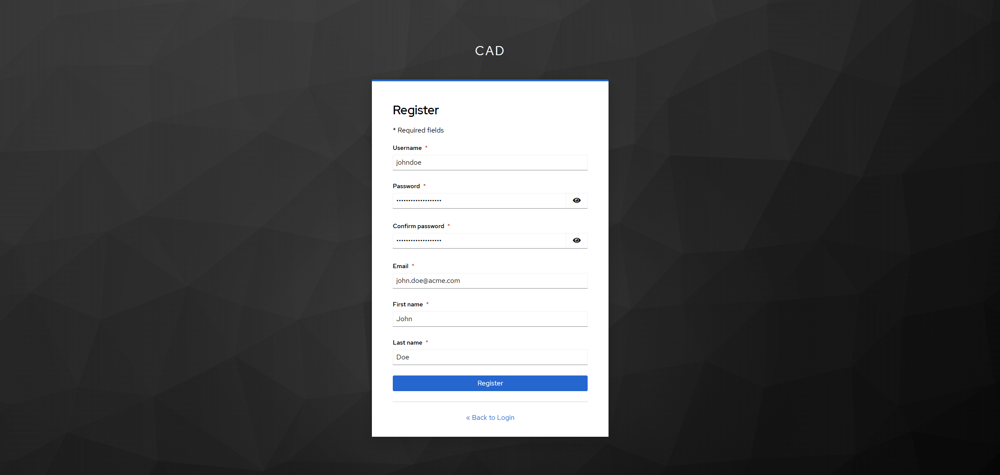
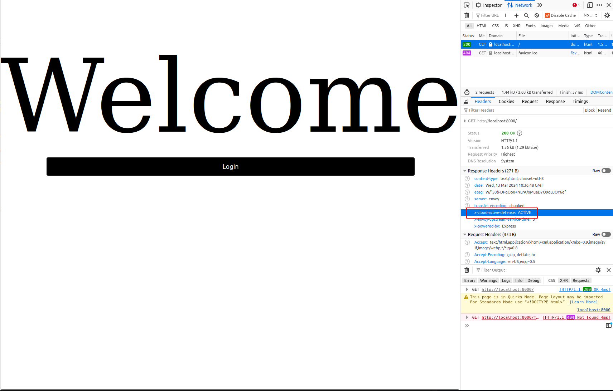
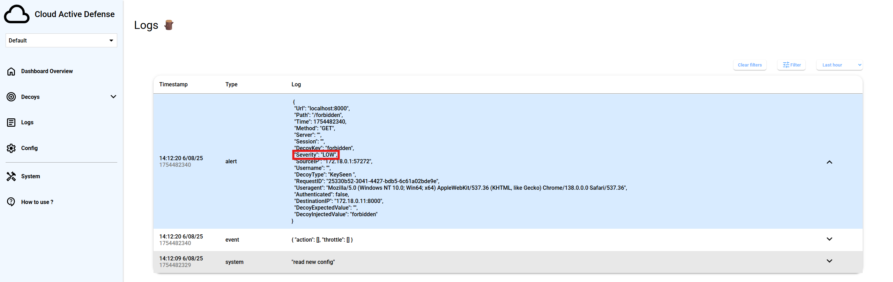
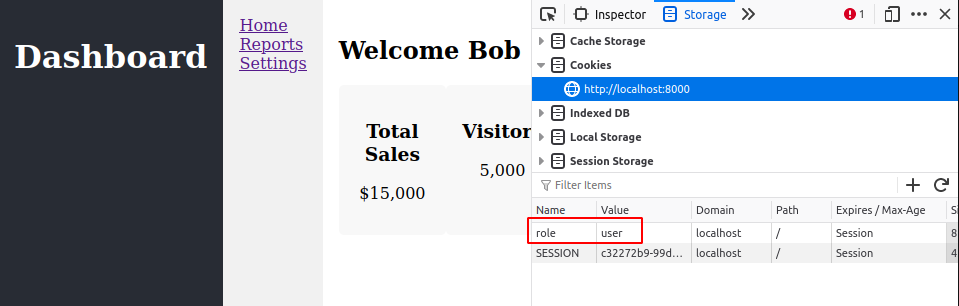
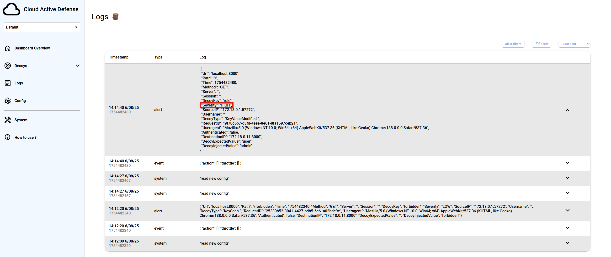
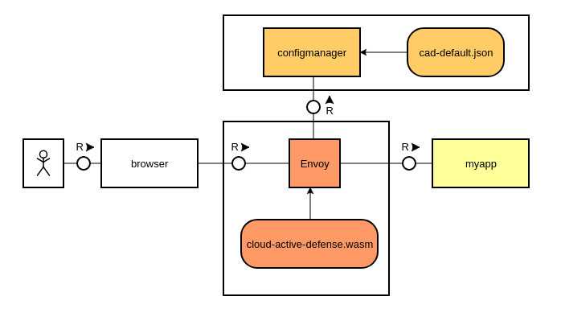
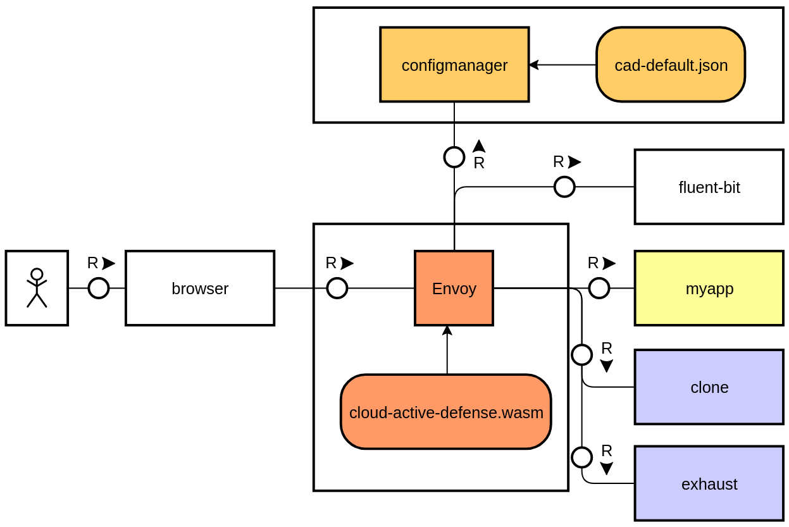

<div align="center">

 [](https://api.reuse.software/info/github.com/SAP/cloud-active-defense)

</div>

# cloud-active-defense

Add a layer of active defense to your cloud applications.

# 5' usage demo (turn on the sound!)

[!](https://github.com/SAP/cloud-active-defense/assets/20401195/472015658-0a4baf61-17a1-48c2-970b-75a78ed73a63)

## Table of Contents
1. [About this project](#about-this-project)
2. [Requirements](#requirements)
3. [Deployment](#deployment)
   - [Option 1 — Kyma (production / SAP BTP)](#option-1--kyma-production--sap-btp)
   - [Option 2 — Full local (all features)](#option-2--full-local-all-features)
   - [Option 3 — Minimal local (decoys + console alerts)](#option-3--minimal-local-decoys--console-alerts)
4. [Developer Guide](#developer-guide)
5. [Architecture and Philosophy](#architecture-and-philosophy)
6. [Configuration and advanced topics](#configuration-and-advanced-topics)
7. [Support, Feedback, Contributing](#support-feedback-contributing)
8. [Security / Disclosure](#security--disclosure)
9. [Code of Conduct](#code-of-conduct)
10. [Licensing](#licensing)

# About this project
Cloud active defense lets you deploy decoys right into your cloud applications, putting adversaries into a dilemma: to hack or not to hack?
  * If they interact with any of your decoys, they are instantly detected.
  * If they refrain, they reduce their ability to attack, making your applications safer.

You win in either case.

# Requirements

- [Docker](https://docs.docker.com/get-docker/)
- [Docker Compose v2](https://docs.docker.com/compose/install/) (`docker compose`, not `docker-compose`)

# Deployment

Cloud active defense can be deployed in three ways. Choose the one that fits your context:

| | Kyma | Full local | Minimal local |
|---|---|---|---|
| **Use case** | Production / SAP BTP | Full feature testing | Quick decoy testing |
| **Keycloak / UI** | yes | yes | no |
| **Alert storage** | Kyma Telemetry | FluentBit → DB | `docker compose logs` |
| **Active response** | yes (clone/exhaust) | yes | no |
| **Requirements** | Kyma cluster + Helm | Docker only | Docker only |

---

## Option 1 — Kyma (production / SAP BTP)

The production deployment uses Helm to install cloud-active-defense as a sidecar service mesh on a SAP Kyma cluster. The Deployment Manager auto-generates API keys, attaches Envoy to each protected workload, and wires up the Kyma Telemetry module for log shipping.

See **[kyma/README.md](kyma/README.md)** for step-by-step instructions.

---

## Option 2 — Full local (all features)

Runs all components locally: Envoy/WASM plugin, Controlpanel API + frontend, Keycloak, Postgres, FluentBit, clone and exhaust honeypots. Use this to explore the full feature set including the management UI and active-response diversion.

### Start

```sh
git clone https://github.com/SAP/cloud-active-defense.git
cd cloud-active-defense
docker compose up --build
```

First startup takes a few minutes while Keycloak initialises.

### Verify it works

1. Open the controlpanel at `http://localhost`

   Keycloak will redirect you to its login page — click **Register** and create an account.

   

2. On the **Decoys › List** tab, check the "default" decoy to deploy it.

3. Visit `http://localhost:8000`. Inspect the response headers (Firefox: `Ctrl+Shift+I` → Network → click the `/` request) and confirm the presence of:

   ```
   x-cloud-active-defense: ACTIVE
   ```

   

### Add a simple decoy

1. In the controlpanel go to **Decoys › List**.
2. Import `examples/simple-decoy.json` and enable it.
3. Check the **Logs** tab for `read new config`.
4. Visit `http://localhost:8000/forbidden`. A LOW-severity alert should appear in the **Logs** tab.

   

### Add a post-authentication decoy

Post-authentication decoys detect compromised user accounts — they are visible only after login.

1. Import `examples/post-auth-decoy.json` and enable it.
2. Visit `http://localhost:8000/login` and log in as **bob@myapp.com / bob**.
3. Open browser DevTools → Storage → Cookies. Notice that a `role=user` cookie has been injected.

   

4. Double-click the cookie value and change it to `admin`, then refresh the page. A HIGH-severity alert fires — someone is trying to escalate privileges.

   

---

## Option 3 — Minimal local (decoys + console alerts)

Runs only three containers: your application, the Envoy/WASM proxy, and a lightweight Python stub that serves the decoy config. No Keycloak, no database, no frontend. Alerts appear in the Envoy container log.

This is the fastest way to try decoys against any Docker-based app, or to run the automated test suite.

### Start

```sh
docker compose -f docker-compose.minimal.yaml up --build
```

Your app is proxied at `http://localhost:8000`.

### Editing decoys

Edit `decoys.json` at the project root. The WASM plugin polls for changes every 60 seconds (`configReload: 60` in the config block). Set it to `1` during development for instant reloads.

```json
{
  "config": { "configReload": 1 },
  "decoys": [ ... ]
}
```

### Viewing alerts

```sh
docker compose -f docker-compose.minimal.yaml logs -f proxy | grep '"type": "alert"'
```

### Protecting your own app

See **[docs/protect-any-app.md](docs/protect-any-app.md)** for a step-by-step guide to adding cloud-active-defense to any Docker-based application, with neowriter as a worked example.

---

# Developer Guide

For full component documentation and architecture details, see **[docs/technical-doc.md](docs/technical-doc.md)**.

## Running the test suite

### Minimal test suite (20 tests, no external dependencies)

Tests cover every inject method (header, cookie, body, status) and every detect pattern (URL, header, cookie, payload, GET/POST params — whenSeen / whenModified / whenAbsent / whenComplete).

```sh
# Start the minimal stack if not already running
docker compose -f docker-compose.minimal.yaml up -d --build

# Run all tests (starts its own isolated stack automatically)
cd tests
bash runMinimalTests.sh
```

Each test writes a one-decoy config to `tests/test-decoys.json`, waits for the WASM plugin to reload, fires a curl request, then checks the proxy logs for the expected alert.

### Full test suite (requires Keycloak + full stack)

```sh
# Start the full stack first
docker compose up -d --build

cd tests
bash runTests.sh
```

### Neowriter integration tests

Tests cloud-active-defense against a real Node.js application with 30+ attack scenario decoys (SSRF, mass assignment, path traversal, Log4Shell, etc.).

```sh
cd tests
bash setup-neowriter.sh          # clones github.com/valvolt/neowriter
bash runNeowriterTests.sh
```

## Rebuilding the WASM plugin

The WASM plugin is pre-built at `proxy/wasm/cloud-active-defense.wasm`. After modifying the Go source in `proxy/wasm/`, rebuild it using Docker (no local TinyGo install needed):

```sh
docker run --rm \
  -v "$(pwd)/proxy/wasm:/src" \
  -w /src \
  tinygo/tinygo:0.31.2 \
  tinygo build -o cloud-active-defense.wasm -scheduler=none -target=wasi ./main.go
```

Then rebuild the proxy image:

```sh
docker compose build proxy
# or for the minimal stack:
docker compose -f docker-compose.minimal.yaml build proxy
```

> **Note:** TinyGo has a limited standard library and no goroutines. See [docs/technical-doc.md](docs/technical-doc.md) for known constraints and the full assessment of the WASM plugin.

---

# Architecture and Philosophy

Cloud active defense is about making hacking *painful*. Attackers rely on information provided by the application to exploit it — and there is no reason not to lie to them.

Our approach introduces a reverse proxy that reads a decoy configuration file, injects deceptive elements into responses, and alerts when those elements are tampered with. No changes to your application code are needed.

For the reverse proxy we chose [Envoy](https://www.envoyproxy.io/): open source, fast, extensible, and a popular choice in service meshes. Cloud active defense is fundamentally an Envoy WASM plugin, which means it deploys as a sidecar on [SAP Kyma](https://kyma-project.io/) or any Kubernetes platform.



Envoy receives a request from the browser, forwards it to the application, and on the way back checks for anything to inject. On the next request, it checks whether any injected element was tampered with and alerts accordingly.

### Full architecture (Option 2 / Kyma)



- **FluentBit** collects Envoy alert logs and ships them to the Controlpanel API and your monitoring tool (Splunk, Loki, Elasticsearch — see [fluentbit.io](https://docs.fluentbit.io/manual/pipeline/outputs)).
- **Clone / Exhaust** are pre-built honeypot endpoints. When a decoy is triggered, Envoy can divert the attacker to the exhaust (for unauthenticated requests) or the clone (for authenticated requests) rather than the real app. See the [wiki](https://github.com/SAP/cloud-active-defense/wiki/Detect#respond) for details.
- **Keycloak** manages authentication for the Controlpanel frontend and API.
- **Controlpanel API + Dashboard** let you create, enable, and monitor decoys through a web UI.

For component-level documentation see **[docs/technical-doc.md](docs/technical-doc.md)**.

## Myapp

Myapp is a minimal demo application bundled with the repository:

- `GET /` — displays "welcome" (unauthenticated) or a static dashboard (authenticated)
- `GET /login` — login form
- `POST /login` — authenticates bob@myapp.com / bob by setting a SESSION cookie

Delete the SESSION cookie to log out.

# Configuration and advanced topics

Please refer to our [wiki](https://github.com/SAP/cloud-active-defense/wiki) for the full decoy configuration reference.

# Support, Feedback, Contributing

The code is provided "as-is" and will be maintained with a best-effort approach.

This project is open to feature requests, bug reports, and contributions via [GitHub issues](https://github.com/SAP/cloud-active-defense/issues).

We welcome:
  * bug reports
  * security improvements
  * decoy ideas (mimicking existing vulnerabilities such as [CVE-2023-32725](https://nvd.nist.gov/vuln/detail/CVE-2023-32725))

For contribution guidelines see [CONTRIBUTING.md](CONTRIBUTING.md).

# Security / Disclosure

If you find a security bug, follow the instructions in our [security policy](https://github.com/SAP/cloud-active-defense/security/policy). Do not open a GitHub issue for security-related problems.

# Code of Conduct

We as members, contributors, and leaders pledge to make participation in our community a harassment-free experience for everyone. By participating in this project, you agree to abide by its [Code of Conduct](https://github.com/SAP/.github/blob/main/CODE_OF_CONDUCT.md) at all times.

# Licensing

Copyright 2024 SAP SE or an SAP affiliate company and cloud-active-defense contributors. Please see our [LICENSE](LICENSE) for copyright and license information. Detailed information including third-party components and their licensing/copyright information is available [via the REUSE tool](https://api.reuse.software/info/github.com/SAP/cloud-active-defense).
