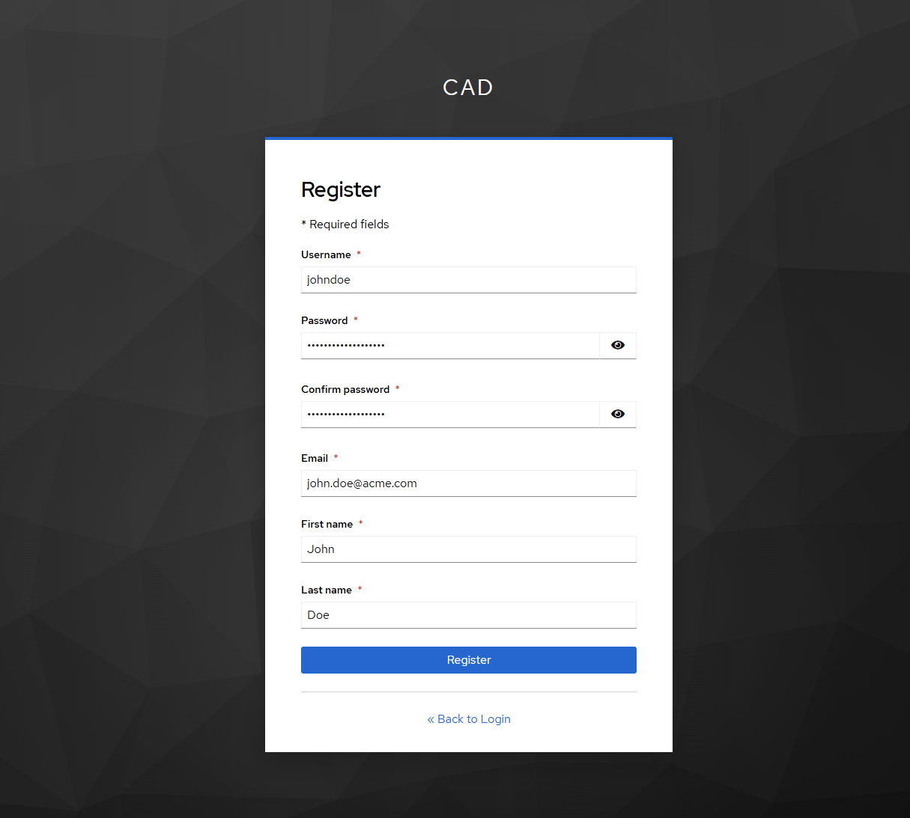
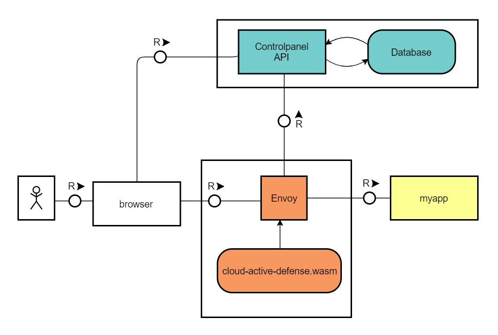
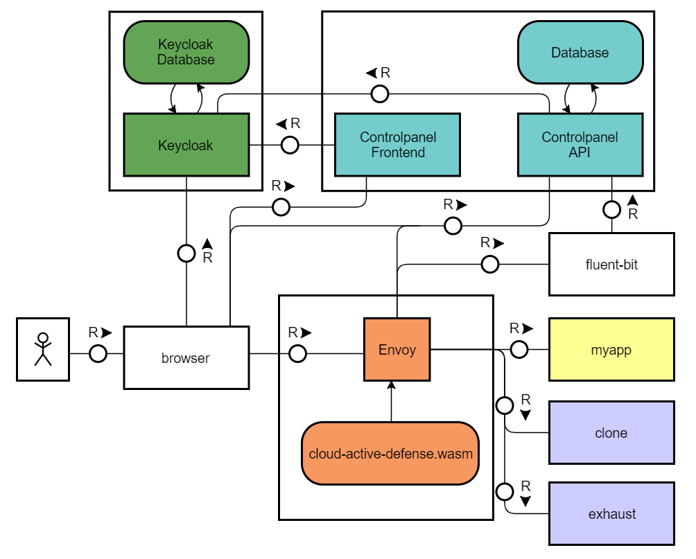

<div align="center">

 [](https://api.reuse.software/info/github.com/SAP/cloud-active-defense)

</div>

# cloud-active-defense

Add a layer of active defense to your cloud applications.

# 5' usage demo (turn on the sound!)

[!](https://github.com/SAP/cloud-active-defense/assets/20401195/472015658-0a4baf61-17a1-48c2-970b-75a78ed73a63)

## Table of Contents
1. [About this project](#About-this-project)
2. [Requirements](#requirements)
3. [Quickstart](#quickstart)
4. [Architecture and Philosophy](#Architecture-and-Philosophy)
5. [Configuration and advanced topics](#Configuration-and-advanced-topics)
6. [Support, Feedback, Contributing](#support-feedback-contributing)
7. [Security / Disclosure](#security--disclosure)
8. [On the TODO list](#on-the-todo-list)
9. [Code of Conduct](#Code-of-Conduct)
10. [Licensing](#Licensing)

# About this project
Cloud active defense lets you deploy decoys right into your cloud applications, putting adversaries into a dilemma: to hack or not to hack?
  * If they interact with any of your decoys, they are instantly detected.
  * If they refrain, they reduce their ability to attack, making your applications safer.

You win in either case.

# Requirements

- [Docker 🐳](https://docs.docker.com/get-docker/)
- [Docker Compose](https://docs.docker.com/compose/install/) (you can do without, but this will make your life easier)


## Optional requirements
If you want to rebuild the plugin, you'll need these:
- [Go 1.19+](https://go.dev/doc/install)
- [TinyGo](https://tinygo.org/getting-started/install/)


# Quickstart

1. clone the repo

`git clone https://github.com/SAP/cloud-active-defense.git`

2. start in demo mode

```
cd cloud-active-defense
docker-compose up --build
```

3. check that it works

Access the controlpanel at `localhost`

Keycloak will redirect you to its own login page, from here click register and created create a new account (or login if you already have an account)


Now that you are logged in keycloak should have redirected you to the controlpanel dashboard

On the `Decoys`>`list` tab you have a "default" decoy to test if everything is working properly
Check that decoy to deploy it

Visit `http://localhost:8000` from a web browser. You should be granted by a 'welcome' page. Inpect the network traffic (In Firefox: `CTRL+SHIFT+I`, visit 'Network', then click on the / request), notice the presence of an HTTP Response Header saying `x-cloud-active-defense=ACTIVE`


## Add a decoy

Let's add a first simple decoy. It won't be very useful but it is easy to understand.

1. open controlpanel at `localhost` and go to `Decoys`>`List` tab

2. import `examples/simple-decoy.json` and check deployed

3. check the `Logs` tab for the following line: `read new config`

4. visit `http://localhost:8000/forbidden`. This should give you an error message `Cannot GET /forbidden`. Check that an alert was sent to `Logs` tab with LOW severity.


## Add a post-authentication decoy

The decoy we just added might trigger if your application is scanned by bots, but what's more interesting is to detect compromised user accounts. So let's create a decoy which will be visible only to authenticated users.

1. open controlpanel at `localhost` and go to `Decoys`>`List` tab

2. import `examples/post-auth-decoy.json` and check deployed

3. check the console for the following line: `wasm log: read new config`

4. visit `http://localhost:8000/login`. Login as **bob@myapp.com/bob**. Press `CTRL-SHIFT-I` to open the developer tools and navigate to the 'storage' tab. Notice how, upon login, a 'role=user' cookie was injected into your cookie jar.


Modify manually the value of the role cookie by double-clicking its value in the developer view. Set it to 'admin', then refresh the page. Notice that an alert was sent to the console with HIGH severity. Seems that Bob is a hacker or that someone who guessed his not-so-strong password is trying to escalate privileges!


# Architecture and Philosophy

Cloud active defense is about making hacking *painful*. Today, attackers rely on the information provided by the application to successfully exploit it. This information is under our control - and there is no reason not to lie to attackers.
We're not the first one to think about deploying deceptive element into applications. The [OWASP AppSensor](https://owasp.org/www-project-appsensor/) project came there first. But adding deceptive traps is an effort that's best kept separate from your application code:

  * developers might not have the time or security skills for that
  * adding code always bears the risk to introduce new (security!) bugs

Our approach was thus to let applications be protected by introducing a reverse-proxy, reading instructions from a versatile configuration file. No risk to introduce bugs to the application, and easy maintenance.

For the reverse-proxy, we chose [Envoy](https://www.envoyproxy.io/). At its heart, cloud active defense is simply a plugin for Envoy. We chose Envoy because it's open source, fast, extensible, and because it's a popular choice as a Service Mesh solution. What this means is that cloud active defense can easily be deployed as a side-car if you use a kubernetes platform such as [SAP Kyma](https://kyma-project.io/). We are doing our best to provide a working solution, but consider testing it heavily before using it productively (and please report any issues you discover!)

Architecture-wise, cloud active defense is a WASM file deployed within Envoy in its own container. As WASM cannot read files from the filesystem, we instead expose the config in the **controlpanel API** service and retrieve it from Envoy via HTTP. In docker, only the default config can be used. When deployed in Kubernetes, each service can have its own config, this is described in its own section.



Envoy receives a request from the **browser** and forwards it to the **application**. Upon receiving the response from the application, Envoy checks if there is something to inject and behaves accordingly. On a subsequent request, Envoy checks if injected elements were interacted with and alerts accordingly.

Cloud active defense complements existing solutions such as Intrusion Detection Systems and honeypot-based deception by instrumenting the target web application itself. By adding decoys based on the application's business logic, you can raise high value, true positive alerts that warn your SOC team in real time before any harm is done. If you deploy decoys visible only to authenticated users, you can further detect account impersonation. This approach makes our solution unique.

## Myapp
Myapp is a demo application which can be used to test how decoys work. It is a simplistic web application with the following features:
  * `GET /` : the front page, displays 'welcome' if you're not authenticated. Displays a static 'dashboard' page otherwise.
  * `GET /login` : a form displaying a login field, a password field, and a submit button.
  * `POST /login` : checks if username is 'bob@myapp.com' and password is 'bob'. It not, sends an error message. If yes, authenticates by setting a (hardcoded) 'SESSION' cookie

There is no logout mechanism. Delete the SESSION cookie to log out.

## Controlpanel API
This API will be the decoy manager for envoy, but also will store the decoys, logs in its database, manage "customer" when deployed on kubernetes and manage other configuration for differents application. It can be connected to the controlpanel frontend

Envoy will send a GET request to the API a few times per minute and update its config accordingly. If running on docker-compose, 'namespace' and 'application' will both be empty strings, thus Envoy will always fetch the content of default config. If running on kubernetes, 'namespace' and 'application' will be properly set, allowing you to define one configuration per application per namespace.

## Envoy
Envoy is an open-source reverse proxy. Upon start, it reads the envoy.yaml config file, which loads the cloud-active-defense.wasm plugin. This plugin reads the content of cad-default.json and applies it upon receiving HTTP requests from the browser and HTTP responses from myapp.

# Full architecture



The full architecture comprises extra containers which achieve the following goals:

## Fluent-bit
Alerts raised by Envoy are sent to its console log. By configuring 'fluentd' as a logging driver, these alerts are sent to a **fluent-bit** container. Fluent-bit can be seen as a pipe which can collect and forward data. By default, fluent-bit will display the collected data to its own console log and send it to the controlpanel API. Now, fluent-bit can be configured to forward these logs to your favorite monitoring tool, such as Splunk, Loki or Elasticsearch. Please refer to [fluentbit.io](https://docs.fluentbit.io/manual/pipeline/outputs) for details.

## Clone and Exhaust
On top of alerting, cloud active defense can be configured to execute an automated response. One such response is to *divert* the adversary to, essentially, a honeypot.

We pre-defined two such diversion endpoints: **clone** and **exhaust**. As with how **myapp** should be replaced with your own application, these two endpoints should be replaced too if you chose to use diversion as a response mechanism.

### Exhaust
Think of this endpoint as a *fake facade*. From the outside it looks like your application, but there is nothing behind. The goal of this facade is to exhaust attackers resources against what is basically a wall.

If, upon detection of an attack, envoy detects that the request to be diverted is not authenticated, then it will forward it to the **exhaust** endpoint instead of **myapp**. The exhaust honeypot can be simply a copy of myapp's publicly reachable pages, with no business logic behind. For the demo, the exhaust app is a copy of myapp without any business logic, meaning that trying to login with valid credentials will be denied. All requests sent to **exhaust** should be considered malicious and are thus logged.

#### (experimental)
You can find in the `exhaust` directory an experimental script to clone your own website to make an exhaust. Since this is experimental it may not be perfect. A readme is provided with more explanation is the same directory

### Clone
Think of this endpoint as a regular *honeypot*. It looks like what is inside your application, but all the content is fake and worthless. The goal of this trap is to further blur the line between what is real and what is not.

If, upon detection of an attack, envoy detects that the request to divert is authenticated, then it will forward it to the **clone** endpoint instead of **myapp**. The clone honeypot should keep the illusion that the user is logged into the real application, so the clone should be a copy of myapp, except for its data, which should be faked. Creating a believable, fake copy of an application is a complex task that we might visit someday. In the meantime, you may want to deploy a second copy of your **exhaust** application as your **clone**. All requests sent to **clone** should be considered malicious and are thus logged.

Please refer to our [wiki](https://github.com/SAP/cloud-active-defense/wiki/Detect#respond) for details.

### Controlpanel Frontend
The frontend is where you can control and manage the decoys you set and have a better view of the alerts sent by fluentbit. This controlpanel provides a way to add/modify, enable or disable a decoy and display the decoys in a list.

### Keycloak
Keycloak is an open-source software product to allow single sign-on with identity and access management aimed at modern applications and services. It will manage users for accessing both controlpanel frontend and API. API routes are all protected with an JWT provided and managed by keycloak avoiding broken access control and allowing anyone to read or change decoys for an application

# Configuration and advanced topics
Please refer to our [wiki](https://github.com/SAP/cloud-active-defense/wiki) page to learn about decoys in details, and about how to modify the source code.

# Support, Feedback, Contributing

The code is provided "as-is" and will be maintained with a best effort approach.
Let's make defense a fun topic ! We hope that you'll fall in love with the concept as much as we are and help us break the attack / defense assymmetry.

This project is open to feature requests/suggestions, bug reports etc. via [GitHub issues](https://github.com/SAP/cloud-active-defense/issues). Contribution and feedback are encouraged and always welcome. 

We are welcoming contributions such as:
  * bug reports
  * security improvements
  * decoy ideas (mimicking existing vulnerabilities such as [CVE-2023-32725](https://nvd.nist.gov/vuln/detail/CVE-2023-32725))

For more information about how to contribute, the project structure, as well as additional contribution information, see our [Contribution Guidelines](CONTRIBUTING.md).

# Security / Disclosure
If you find any bug that may be a security problem, please follow our instructions at [in our security policy](https://github.com/SAP/cloud-active-defense/security/policy) on how to report it. Please do not create GitHub issues for security-related doubts or problems.

# On the TODO list
Features we plan to eventually release:
  * [DONE] adding a configuration specifying where to find information about the user's session. We want to use this to add session / logged in user information in the alert.
  * [DONE] show how to ingest alerts into fluentd for further processing (currently alerts are simply shown on the console)
  * [DONE] show how to deploy into SAP Kyma as an extension of the mesh service

# Code of Conduct

We as members, contributors, and leaders pledge to make participation in our community a harassment-free experience for everyone. By participating in this project, you agree to abide by its [Code of Conduct](https://github.com/SAP/.github/blob/main/CODE_OF_CONDUCT.md) at all times.

# Licensing

Copyright 2024 SAP SE or an SAP affiliate company and cloud-active-defense contributors. Please see our [LICENSE](LICENSE) for copyright and license information. Detailed information including third-party components and their licensing/copyright information is available [via the REUSE tool](https://api.reuse.software/info/github.com/SAP/cloud-active-defense).
