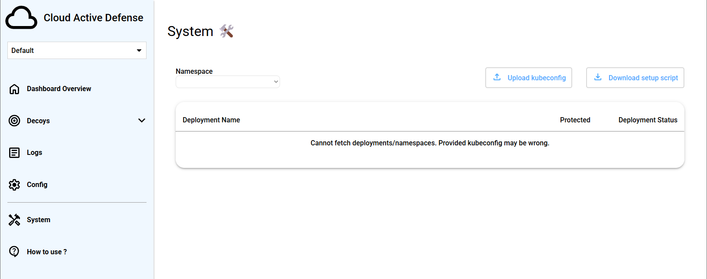
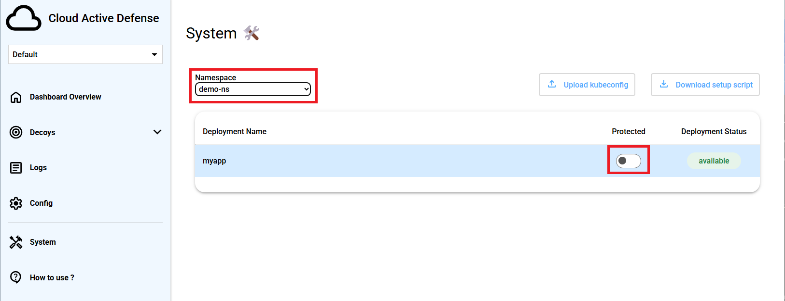
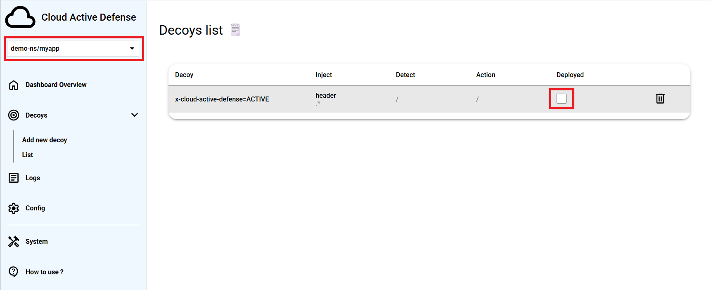

# Kyma deployment

## Requirements
- To deploy Cloud Active Defense on Kyma you first need either install Kyma on your local machine or use SAP BTP cloud
    - To install Kyma locally follow these instructions:
        - Install [k3d](https://k3d.io/v5.6.3/#installation)
        - Follow these steps before setting up Kyma: [Steps for local Kyma](https://github.com/kyma-project/api-gateway/issues/1133)
        - Install Kyma with [Kyma documentation](https://kyma-project.io/#/02-get-started/01-quick-install)(Mandatory modules are Istio and API Gateway)

    - To use Kyma in SAP BTP cloud follow these instructions:
        - [Create an account in SAP cloud](https://developers.sap.com/tutorials/btp-free-tier-account.html) (You can skip final steps from step 9)
        - [Enable Kyma](https://developers.sap.com/tutorials/cp-kyma-getting-started.html)
        - [Connect to remote cluster](https://developers.sap.com/tutorials/cp-kyma-download-cli.html)

- Install [helm](https://helm.sh/docs/intro/install/) to manage kubernetes configuration files

## 1. Setup install
Before installing, you want to change some values in [values.yaml](./values.yaml)
The values.yaml file is where all the variables are stored for the install and where you will have to set the missing ones

### For global:
You will have to set
- `db_user` with the database user you want, a default one will be set if not changed
- `db_password` with a secure password, a default one will be set if not changed (**not recommended**)
- `kyma_domain` with the correct kyma domain provided (e.g. `c-28e44bf.kyma.ondemand.com`)

### For controlpanel_api:
You will only have to set
- `deploymentmanager_db_password` with a secure password, a default one will be set if not changed (**not recommended**)
Please use the same password set for deployment-manager chart (if already set)

### For keycloak:
You will have to set
- `db_user` with the database user you want for keycloak, a default one will be set if not changed
- `db_password` with a secure password, a default one will be set if not changed (**not recommended**)
- `kc_username` with the keycloak user you want for keycloak admin panel, a default one will be set if not changed
- `kc_password` with a secure password for keycloak admin panel, a default one will be set if not changed (**not recommended**)

## 2. Install

Now that you set all the values, you only have to run this to install everything at once:
```shell
helm install controlpanel .
```

> [!TIP]
> You can also install each helm chart separately to have more control over it, but it is not necessary
> To do that you must set all the values specified before but in it's own helm chart values

This command installs: 
- Controlpanel API/Frontend (This is where you will be able to manager decoys/config, look Cloud Active Defense alerts...)
- Deployment manager (It will help to install all the necessary configuration to setup your cluster with Cloud Active Defense)
- Keycloak (That manages authentication to both controlpanel API and dashboard )

> [!NOTE]
> The install can sometimes take few minutes, so please be patient before testing

## 3. Install + protect demo

### Install
Now that you have installed the controlpanel, you could try to protect the demo app provided

First let's install the demo app (myapp):
```shell
helm install myapp myapp
```

### Protect
Now to access the controlpanel go to `https://controlpanel-front.<KYMA_DOMAIN>` (e.g. `https://controlpanel-front.c-28e44bf.kyma.ondemand.com`)

Keycloak will redirect you to its own login page, from here click register and created create a new account (or login if you already have an account)


Now that you are logged in keycloak should have redirected you to the controlpanel dashboard

Go to `System` tab and click on `Download setup script` button and execute the provided script
After that, click on `Upload kubeconfig` and use the kubeconfig file that the script just output


From there you can select the desired namespace and turn on the deployment to protect (`demo-ns` as namespace and `myapp` as deployment for the demo)


> [!NOTE]
> The protect loading can take few seconds

### Test

You might want to see if the application is protected by Cloud Active Defense now

Because a new app is protected you should have a new option in the select box at the top-left (`demo-ns/myapp` for the demo). Select it and go to `Decoys` and `List` tab

On the `Decoys list` tab you have a "default" decoy to test if everything is working properly
Check that decoy to deploy it


Now to access the demo app, go to `https://myapp.<KYMA_DOMAIN>` (e.g. `https://myapp.c-28e44bf.kyma.ondemand.com`)

You should be granted by a 'welcome' page. Inspect the network traffic (In Firefox: CTRL+SHIFT+I, visit 'Network', then click on the / request), notice the presence of an HTTP Response Header saying x-cloud-active-defense=ACTIVE


That means your application is protected

To go further you can udapte that decoy or add a new one with a 'detect' section and trigger it in the demo app. By doing this you should have an alert in `Logs` tab

There are some decoys examples/ideas in the wiki to play with to see the full potential of Cloud Active Defense