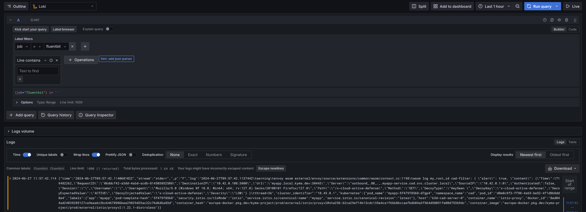

# Kyma deployment

## Requirements
- To deploy Cloud Active Defense on Kyma you first need either install Kyma on your local machine or use SAP BTP cloud
    - To install Kyma locally follow these instructions:
        - Install [k3d](https://k3d.io/v5.6.3/#installation)
        - Follow these steps before setting up Kyma: [Steps for local Kyma](https://github.com/kyma-project/api-gateway/issues/1133)
        - Install Kyma with [Kyma documentation](https://kyma-project.io/#/02-get-started/01-quick-install)(Mandatory modules are Istio and API Gateway)

    - To use Kyma in SAP BTP cloud follow these instructions:
        - [Create an account in SAP cloud](https://developers.sap.com/tutorials/btp-free-tier-account.html) (You can skip final steps from step 9)
        - [Enable Kyma](https://developers.sap.com/tutorials/cp-kyma-getting-started.html)
        - [Connect to remote cluster](https://developers.sap.com/tutorials/cp-kyma-download-cli.html)

- Install [helm](https://helm.sh/docs/intro/install/) to manage kubernetes configuration files

If you wish to build and use your own images of the project follow the instructions in each steps

## 1. Configmanager

The only thing to replace in `values.yaml` is `configimage` with configmanager image

<!-- Also modify the `cad-default.json` with your decoys config or keep the default one -->

If you wish to use your own image of configmanager, go to `configmanager/` directory from the root of the project and build the Dockerfile inside

Then run 
```shell
helm install configmanager ./configmanager
```

## 2. Collect logs

To use telemetry, first install Telemetry module to Kyma:

```shell
kubectl apply -f https://github.com/kyma-project/telemetry-manager/releases/latest/download/telemetry-manager.yaml
kubectl apply -f https://github.com/kyma-project/telemetry-manager/releases/latest/download/telemetry-default-cr.yaml -n kyma-system
```

Go to telemetry directory and edit the `namespace` value in `values.json`

Now install loki and grafana (Replace `log-sink` with the same namespace you just set in `values.json`)
```shell
helm repo add grafana https://grafana.github.io/helm-charts
helm repo update
helm upgrade --install --create-namespace -n log-sink loki-app grafana/loki -f ./telemetry/loki-values.yaml
helm upgrade --install --create-namespace -n log-sink grafana-app grafana/grafana -f ./telemetry/grafana-values.yaml
```

Then run the following command:
```shell
helm install telemetry telemetry
```

To get grafana password and access to the dashboard run this command:

For linux:
```shell
kubectl get secret --namespace log-sink grafana -o jsonpath="{.data.admin-password}" | base64 --decode ; echo
```

For windows:
```shell
kubectl get secret --namespace log-sink grafana -o jsonpath="{.data.admin-password}" | echo | ForEach-Object {[System.Text.Encoding]::UTF8.GetString([System.Convert]::FromBase64String($_))}
```

Now log in with user admin and the password you retrived before

On the Explore page (where the logs are gonna be listed), add a label filter with `job` as key and `fluentbit` as value

Now you are all setup up, you should be able to see the logs from cloud-active-defense in grafana

<!-- Try go to your app with this endpoint `/x-cloud-active-defense`, a decoy will be triggered and send logs to grafana -->
Example:


## 3. Wasm

Same as before you have to replace `initimage` in `values.yaml` with the init image that you can create with the given Dockerfile

If you wish to use your own image of the proxy, build the Dockerfile from `wasm/` directory 

Then run:
```shell
helm install wasm ./wasm
```

## 4. MyApp

In `values.yaml` if needed replace the image of myapp in `image` (by defaut it uses the image on github registry), you can also change the namespace and the number of replicas

If you wish to use your own image of myapp, go to `myapp/` directory from the root of the project and build the Dockerfile inside

Then run:
```shell
helm install myapp ./myapp
```

If everything went good, you should be able to navigate to myapp with the link provided in `Api Rules`

## 4. Envoy config

In `envoy-reconfig.yaml` you will have to change few values:

- First you can change `metadata.name` to make it more understable based on your configuration
- Change `metadata.namespace` with the same namespace you set for myapp in step 1
- Replace the value in `spec.workloadSelector.labels.app` with the name of your app in step 1

Also change `name` and `namespace` in `resources-patch.yaml` so it match step 1 and the previous json

Then run the following command:

For linux:
```shell
helm upgrade myapp ./myapp --post-renderer ./envoy-config/kustomize.sh
```

For windows:
```shell
helm upgrade myapp ./myapp --post-renderer ./envoy-config/kustomize.bat
```

## 5. Clone & Exhaust

In the proxy you have the option to redirect to the clone or the exhaust, if you will use these option you will have to install it now

To install the clone and the exhaust you will have few things to modifiy, for each:

In values.yaml if needed replace the image of the clone in image (by default it uses the image on github registry) and the `deploymentName` that correspond to the name of you application (for the demo it is myapp), you can also change the namespace (has to match where you deployed your application) and the number of replicas

Then run
```shell
helm install clone clone
```
Or
```shell
helm install exhaust exhaust
```

After you installed it you must add the clone/exhaust to envoy configuration, for this you need to `envoy-config` directory and:
1. Modifiy the kustomize script (depending on which OS you use, modifiy either the shell one for linux and batch one for Windows) at line 4 you need to change first the name of the envoyfilter you set (only if you changed it before) and the namespace where you deployed it
2. Modifiy the `kustomization.yaml` and change the name of the envoyfilter with the one you set (like previous step)
3. Modify `envoy-patch.yaml` and change the cluster value with yours, you have to change the name and the namespace so it match your configuration (only if you have a custom clone app, you can keep the default value for the demo) like this: outbound|80||<clone/exhaust_service_name>.<app_namespace>.svc.cluster.local

Then run the following command:

For linux:
```shell
bash ./clone/envoy-config/kustomize.sh
```
For windows:
```shell
./clone/envoy-config/kustomize.bat
```

Or:

For linux:
```shell
bash ./exhaust/envoy-config/kustomize.sh
```
For windows:
```shell
./exhaust/envoy-config/kustomize.bat
```